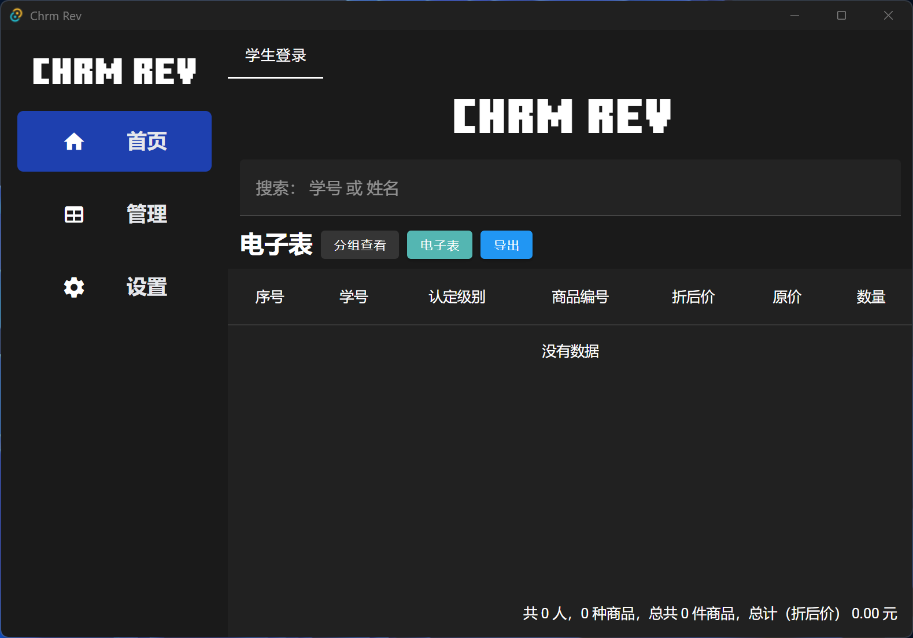

## Introduction

本项目为岭南师范学院“爱心驿站”项目提供业务系统支持，主要用于商品购买登记、销售统计等日常操作，旨在提升工作效率，简化流程。

    “爱心驿站”是岭南师范学院学生处下属的非营利性学生资助项目，致力于为学生服务，经认定的家庭经济困难学子在驿站购买生活用品和学习用品时可享受相应折扣。

## Preview



### Continuation of Chrm

本项目（`chrm-rev`）是原 Chrm 系统（© 2013-2019 RT Studio Corporation 版权所有）的延续版本。

## License

本项目依据 GNU Affero General Public License v3.0（AGPLv3） 授权开源。

## Version

- **v1.0.0** - 2025.11.08

## Windows 7 兼容性说明

- 如需在 Windows 7 上运行，需安装部分 windows 更新

  推荐使用 `UpdatePack7R2` 或 [Microsoft®Update Catalog](https://www.catalog.update.microsoft.com/Home.aspx)

## Contributions

```sh
# 环境配置
rustup component add rust-std-i686-pc-windows-msvc

pnpm i
pnpm tauri dev

# build
pnpm tauri build
```

修改数据库表

```sh
cargo run --bin migration up
sea-orm-cli generate entity -o caches

# 需手动将 caches/ 中的更新同步到 src-tauri/entity/

# 同步ts类型绑定
cargo test export_bindings
```

## Acknowledgement

This project was inspired by these projects and so on:

- [Vaultwarden](https://github.com/dani-garcia/vaultwarden)

- [Clash Verge Rev](https://github.com/clash-verge-rev/clash-verge-rev)

- **Chrm** © 2013-2019 RT Studio Corporation
