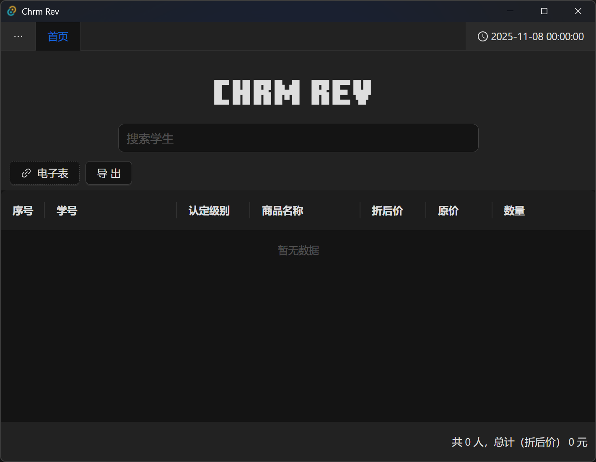
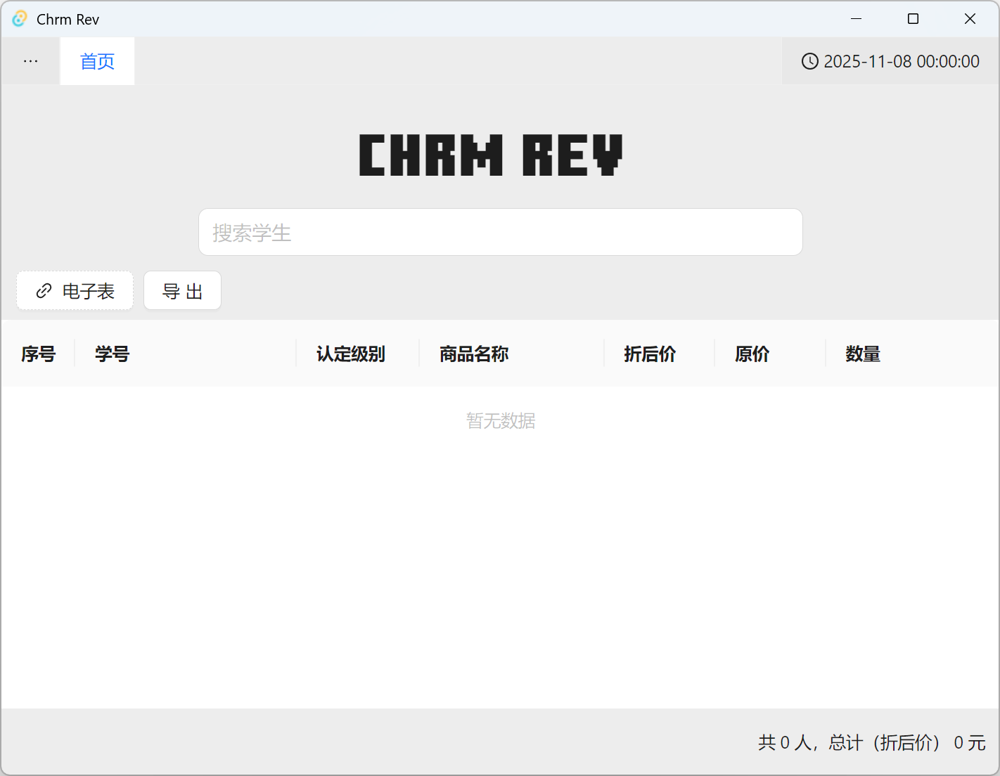
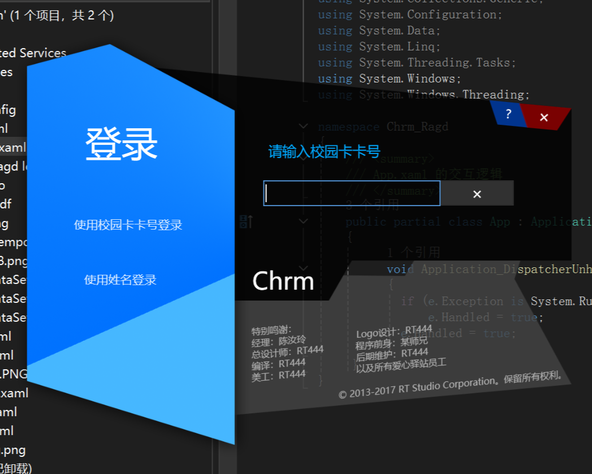

# Chrm Rev

## Introduction

本项目为岭南师范学院“爱心驿站”提供业务系统支持。

> "爱心驿站"创立于 2013 年 6 月，是岭南师范学院为家庭经济困难学生提供完善、到位的资助与帮扶而设立的非营利性质的家庭经济困难学生资助平台。经学校认证的家庭经济困难学子，在驿站购买生活用品和学习用品时，可享受相应折扣。

## Preview

| Dark                                           | Light                                           |
| ---------------------------------------------- | ----------------------------------------------- |
|  |  |

### Next-Generation Chrm

Chrm Rev is a Tauri-based rewrite of the legacy Chrm system (© 2013–2017 RT Studio Corporation), inheriting only its name and purpose.

_Screenshot of the original Chrm system_

## Version

- **v1.0.0** - 2025.11.08

- **v1.1.0** - 2026.04.24

## Windows 7 兼容性说明

- 如需在 Windows 7 上运行，需安装 windows 更新

  推荐使用 [UpdatePack7R2](https://blog.simplix.info/update7) 或 [Microsoft®Update Catalog](https://www.catalog.update.microsoft.com/Home.aspx)

## Acknowledgement

This project was inspired by the following projects:

- [Vaultwarden](https://github.com/dani-garcia/vaultwarden)

- [Clash Verge Rev](https://github.com/clash-verge-rev/clash-verge-rev)

- **Chrm** © 2013-2017 RT Studio Corporation

## License

GNU Affero General Public License v3.0（AGPLv3）
