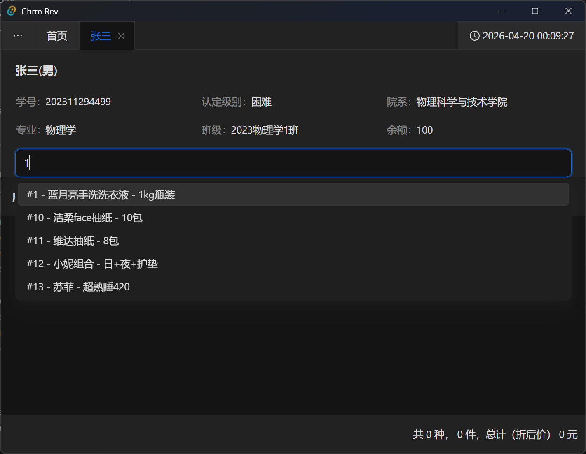
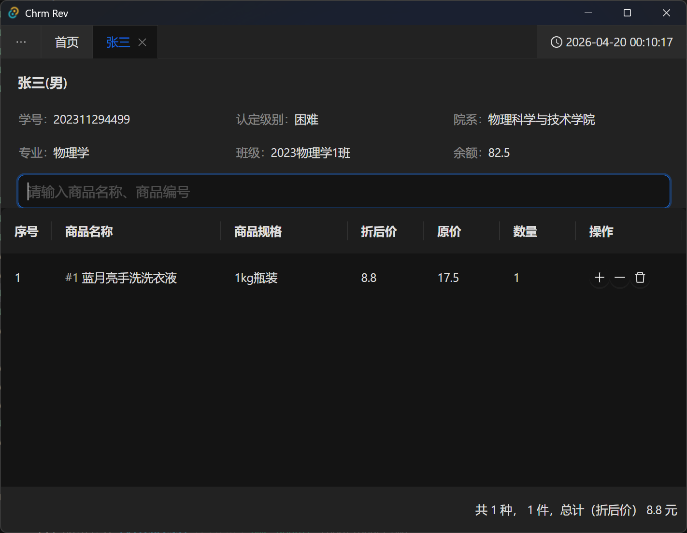
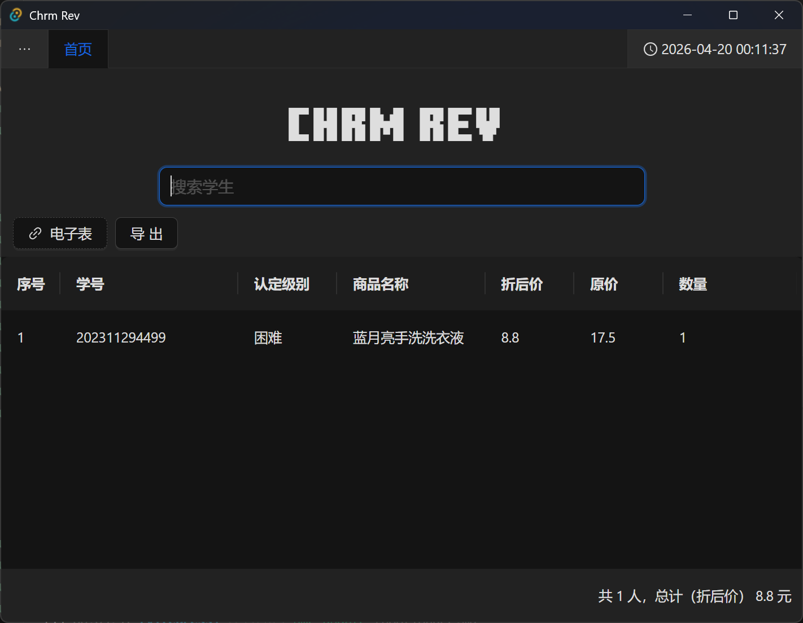
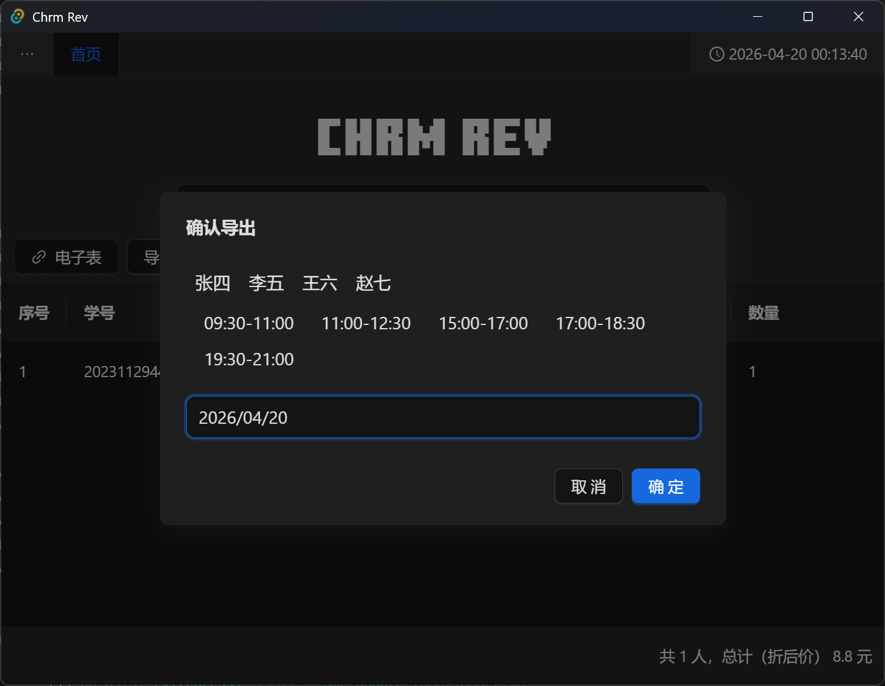

## 搜索学生

你可以在首页输入框中搜索学生(可输入学号、姓名等)

（如果认定数据中没有学号数据、可能需要使用身份证代替学号进行搜索

## 添加商品

搜索学生后，点击学生姓名标签，进入学生界面。

此界面显示学生的详细信息。

在中间的搜索框输入商品的编号或名称即可添加商品

右下角显示总计折后价，请核对商品数量后报价支付。

支付完成后可关闭标签页。

首页就会出现对应的记录，右下角为所有未导出记录的总折后金额

值班时段结束后，点击首页导出按钮、并选择匹配的人员、时段生成签名。

如果签名生成不对可手动修改，并完成导出

