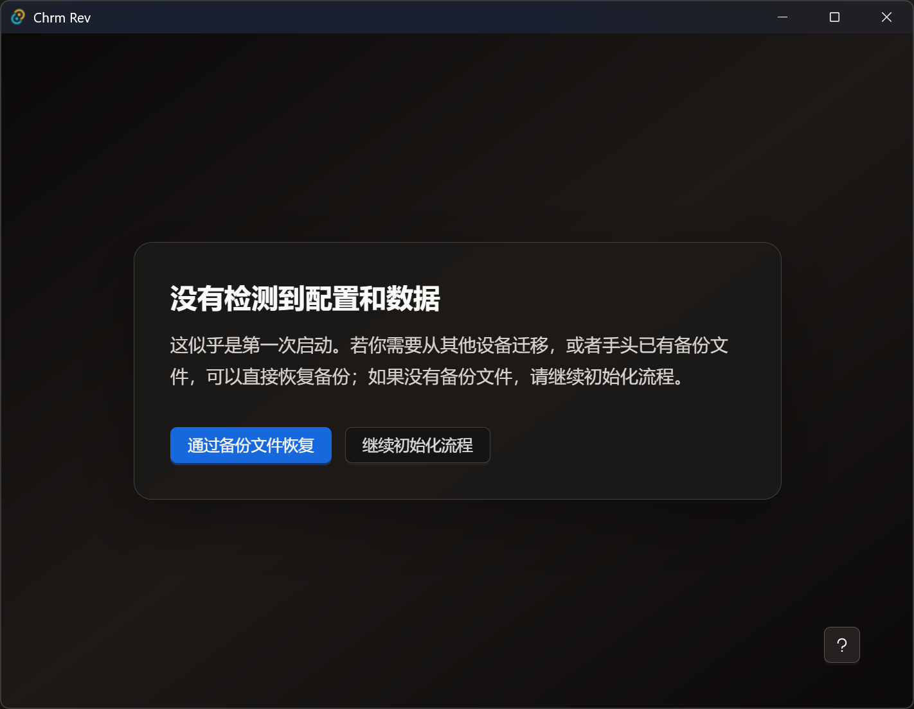

# 启动自检流程说明

Chrm Rev启动时会检查并尝试加载数据目录下的[配置文件](./datadir.md)和[数据库文件](./datadir.md)

## BackupManager

如果配置文件和数据库文件都不存在，会先跳转到恢复备份页面

> 你可以在这里直接恢复备份文件，或跳过以继续初始化流程

## Configloader

如果配置文件不存在，会优先进入这个页面，必须先保存配置才能继续。

[配置参考](./configloader.md)

## Dataloader

如果数据库文件不存在或未创建表，则会进入这个页面。

[导入工具使用帮助](./dataloader.md)
