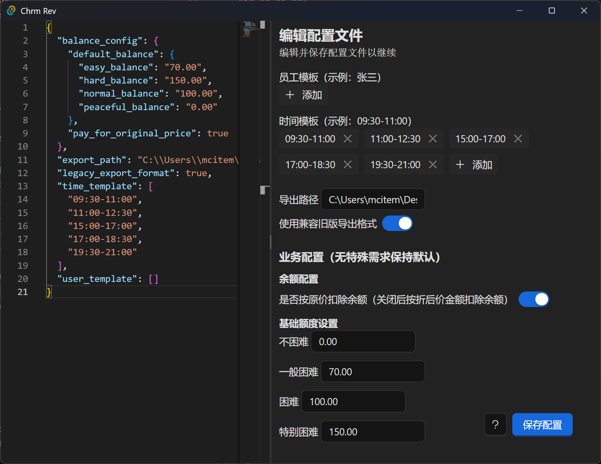

## Chrm Rev 配置参考（chrm-rev.config.json）

Chrm Rev自带可视化配置编辑器，可通过左上角`菜单-管理-配置管理`启动



可通过左侧编辑`json`源代码，或者右侧的图形化工具进行编辑配置，，最后点击右下角`保存配置`即可

## 完整配置参考

```json
{
  "export_path": "C:\\..path..to..\\电子表.csv",
  "legacy_export_format": true,
  "user_template": ["张三", "李四"],
  "time_template": [
    "09:30-11:00",
    "11:00-12:30",
    "15:00-17:00",
    "17:00-18:30",
    "19:30-21:00"
  ],
  "balance_config": {
    "pay_for_original_price": true,
    "default_balance": {
      "peaceful_balance": "0.00",
      "easy_balance": "70.00",
      "normal_balance": "100.00",
      "hard_balance": "150.00"
    }
  }
}
```

## export_path

电子表的导出路径，必填，且必须为.csv结尾的路径格式。

在导出时若文件不存在会自动创建

填写示例

```json
"C:\\Users\\mcitem\\Desktop\\12月电子表.csv"
```

::: info
`.csv`文件是以逗号分割的纯文本格式，且能通过 ececl、记事本等直接打开。但不适合用于存储长数字格式，否则会出现精度丢失问题。
:::

## legacy_export_format

默认为`true`,关闭（`false`）后导出时会携带更多信息、如商品名称等

## user_template

导出签名时提供的可选用户模板

填写示例

```json
["张三", "李四"]
```

## time_template

导出签名时提供的时间段选择模板

填写示例

```json
[
  "09:30-11:00",
  "11:00-12:30",
  "15:00-17:00",
  "17:00-18:30",
  "19:30-21:00"
]
```

# balance_config

余额相关配置，[余额介绍](./balance.md)

## pay_for_original_price

是否按原价扣除余额

默认为`true`,关闭(`false`)后按折后价扣除学生余额

## default_balance

::: warning
**注意，此配置仅在导入时生效，如果学生已经被导入，无法通过这个配置修改已经被导入学生初始额度**
:::
在数据导入时，不同认定级别学生的初始化余额额度

~~[Minecraft /difficulty](https://zh.minecraft.wiki/w/%E5%91%BD%E4%BB%A4/difficulty#%E5%8F%82%E6%95%B0)~~

### peaceful_balance

不困难的初始额度，默认为`0.00`

### easy_balance

一般困难的初始额度，默认为`70.00`

### normal_balance

困难的初始额度，默认为`100.00`

### hard_balance

特别困难的初始额度，默认为`150.00`
