# 使用 daragrip 编辑数据

能够图形化打开sqlite数据库的软件都能对数据库进行编辑，这里以datagrip为例

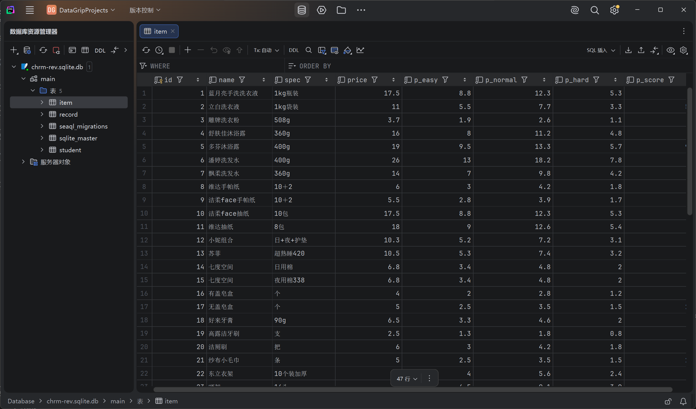

## 下载

官方下载地址

```
https://www.jetbrains.com/datagrip/
```


## 准备

你需要将数据库文件提取到自己的个人电脑上，你可以手动从数据目录中备份出来，也可以直接解压`菜单-管理-数据备份`生成的备份压缩文件获得。

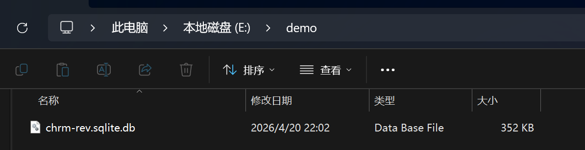

## 汉化

在首页右下角打开设置

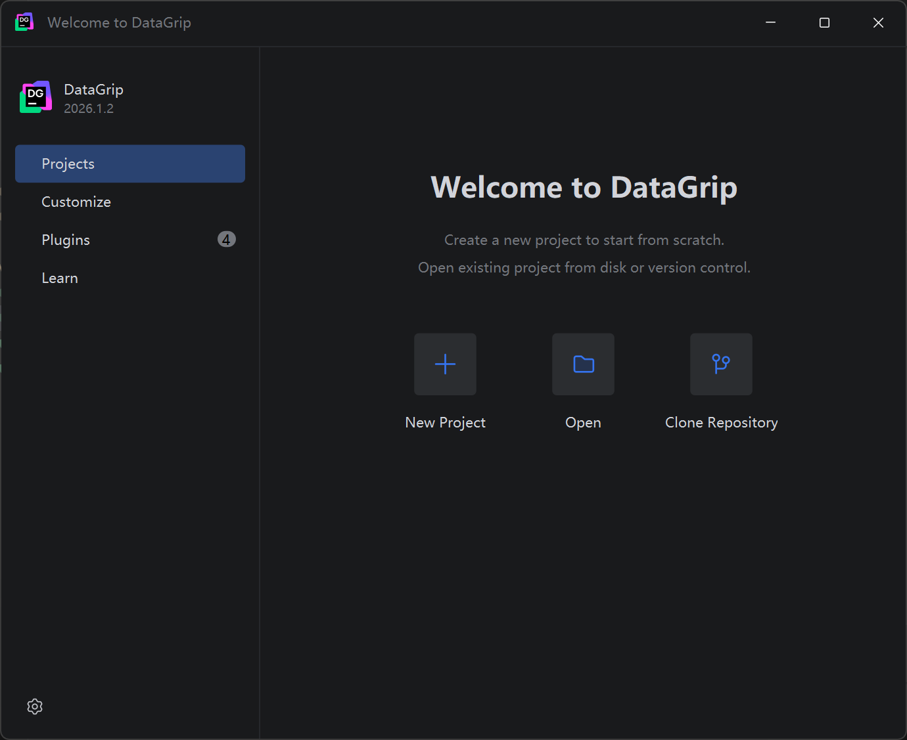

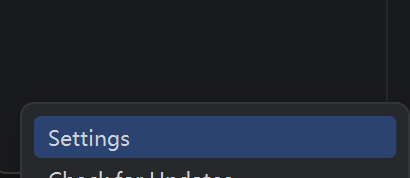

找到`Appearance & Behavior-System Settings-Language and Region`修改语言为中文

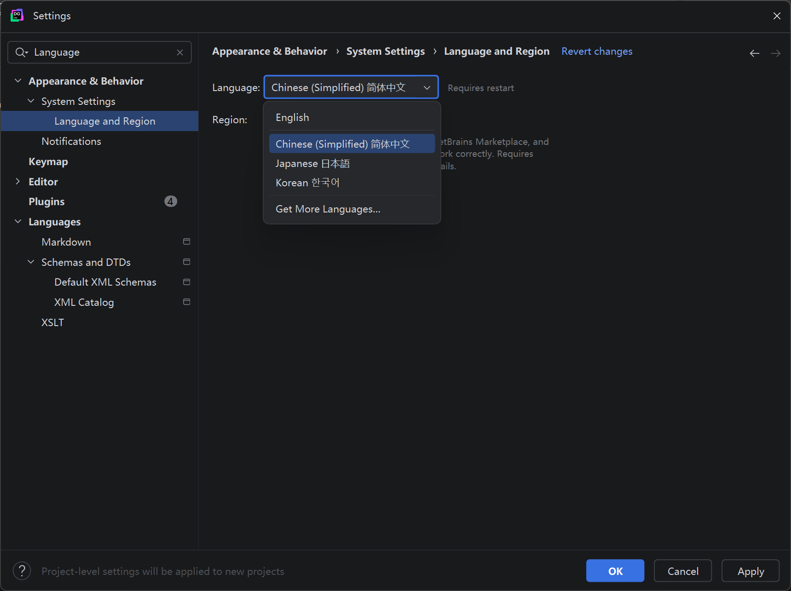

## 连接到数据库

在首页点击创建项目，新建一个空白的项目，不填名称直接点击确定


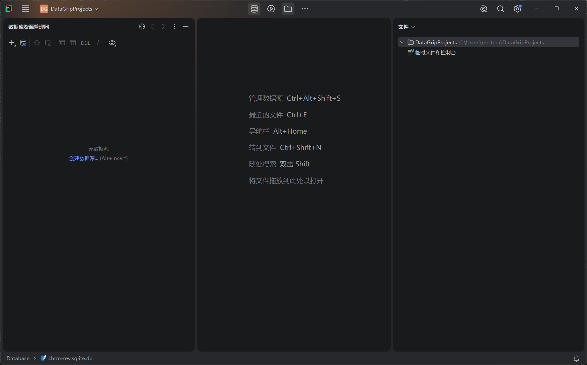

点击创建数据源，在数据源中找到sqlite

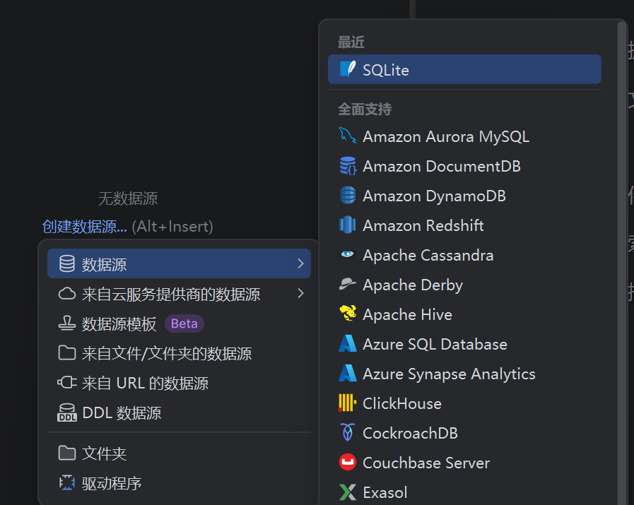

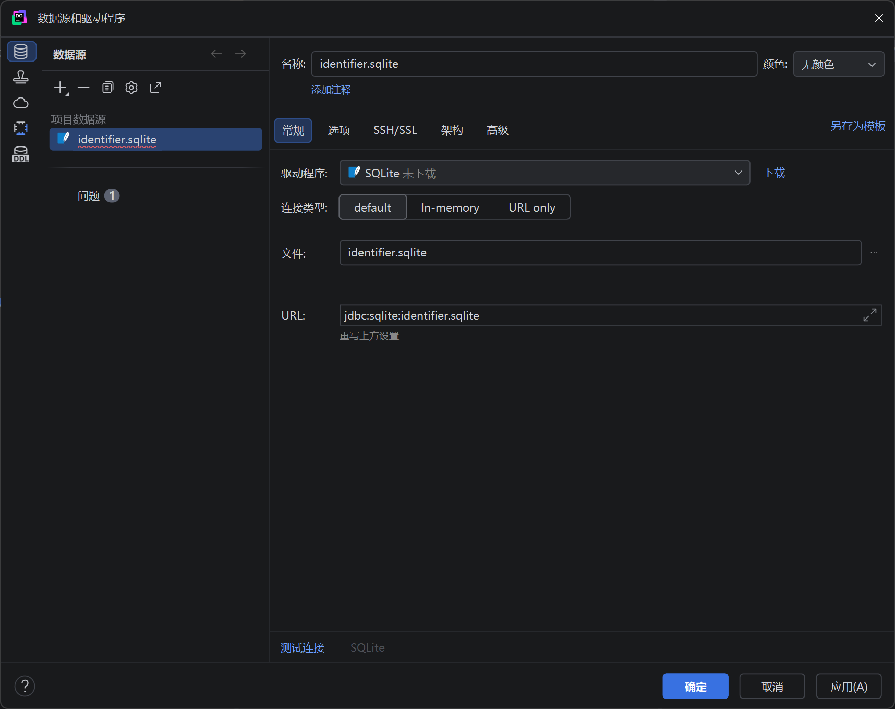

其他设置保持默认，我们点击文件选择右侧的打开按钮

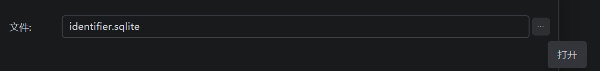

在弹出的窗口中选择我们的数据库文件`chrm-rev.sqlite.db`
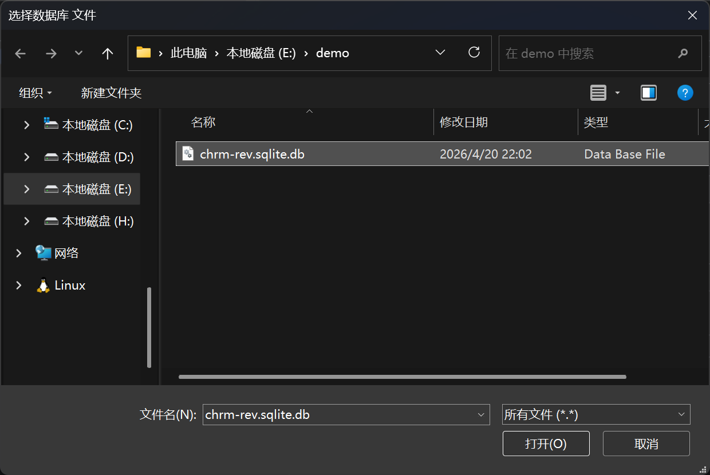

点击测试连接，会提示我们下载驱动程序，点击确定

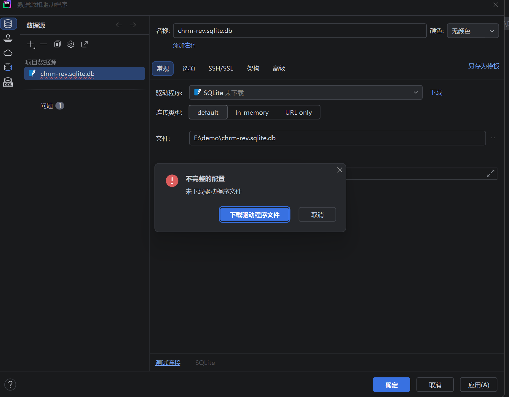

点击确定，datagrip自动下载驱动程序

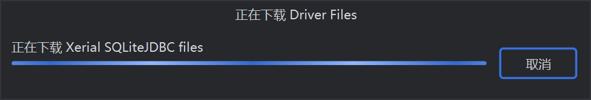

我们可以看到测试连接提示连接成功了，这时候我们点击右下角的应用并点击确定关闭这个窗口

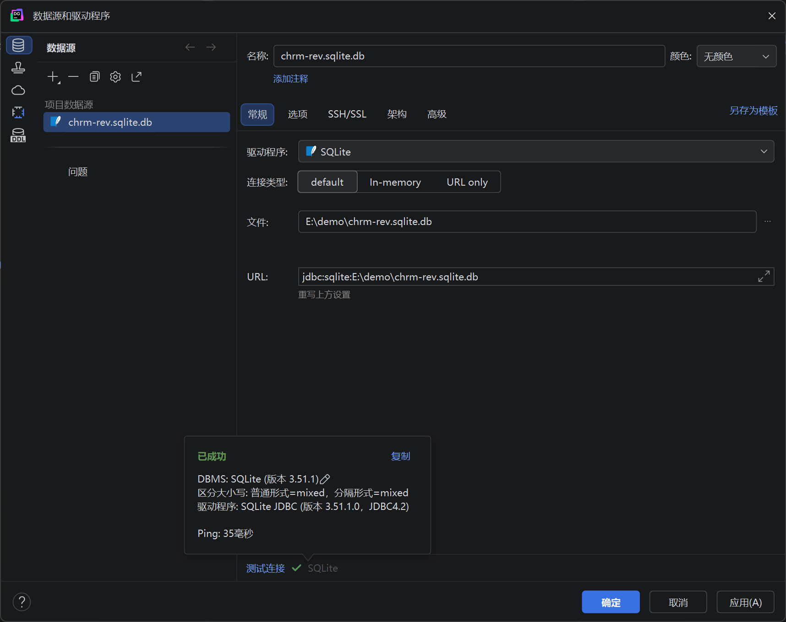

在左侧我们已经可以看到我们的数据库

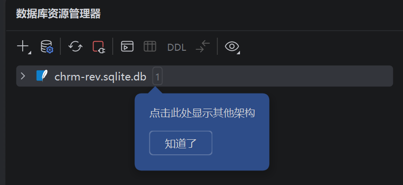

依次展开就能看到数据库中的数据表

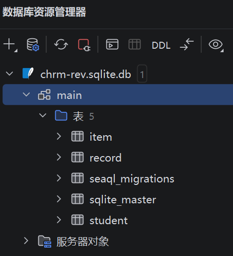

双击打开，就能看到内部的数据了。

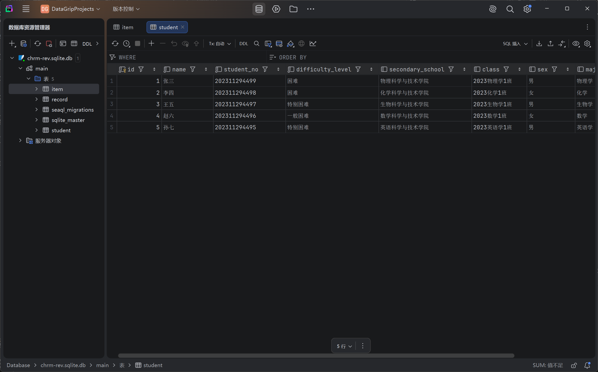

双击单元格进行编辑，在编辑完成之后，需要点击绿色的小箭头提交改动

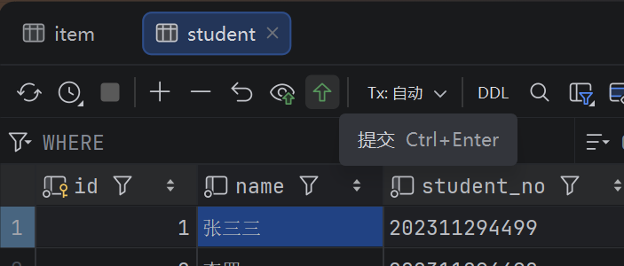

提交后对数据库的修改就完成了。

将修改过后的数据库粘贴并替换掉原有的数据库，就已经完成了对数据的编辑
