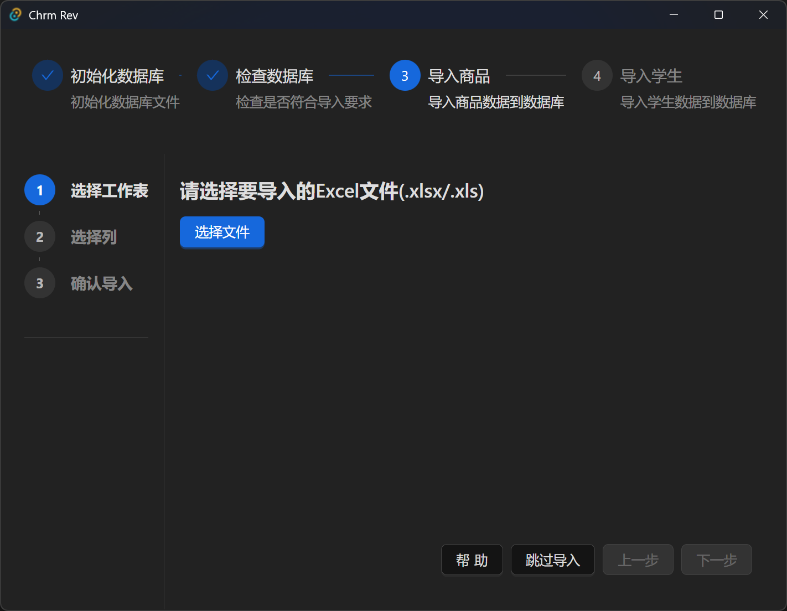
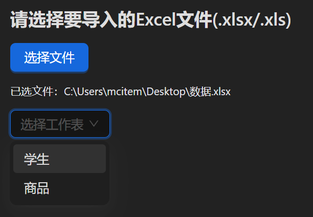
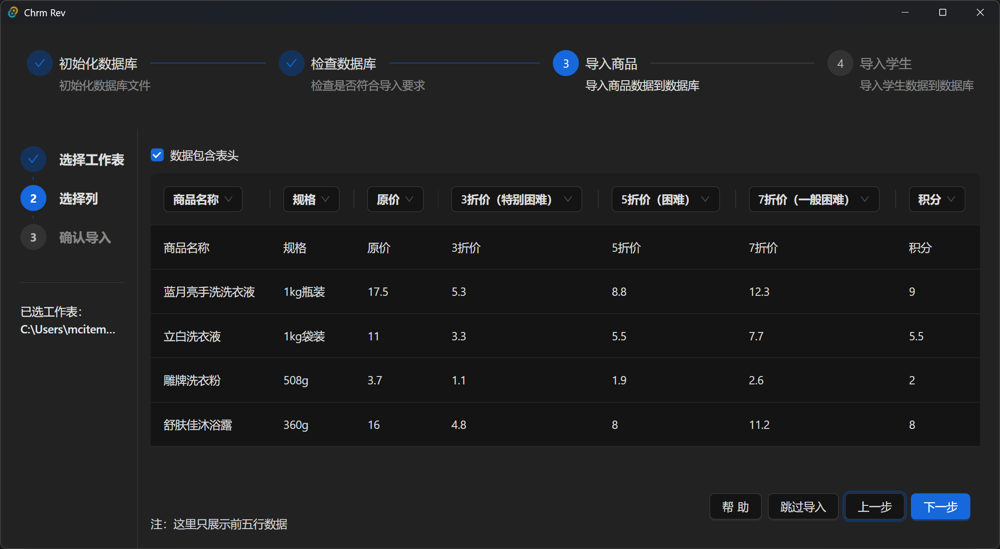
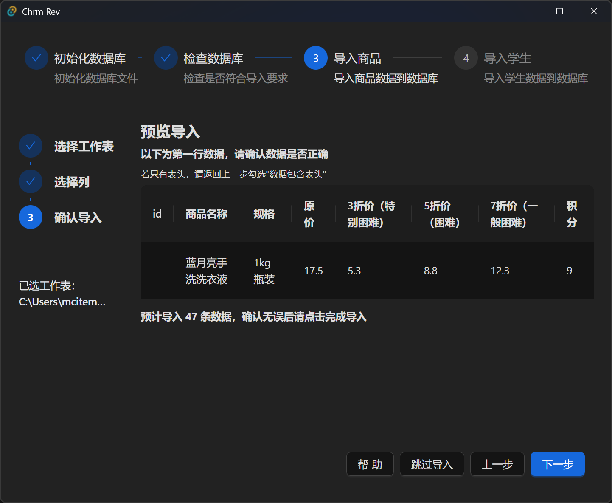
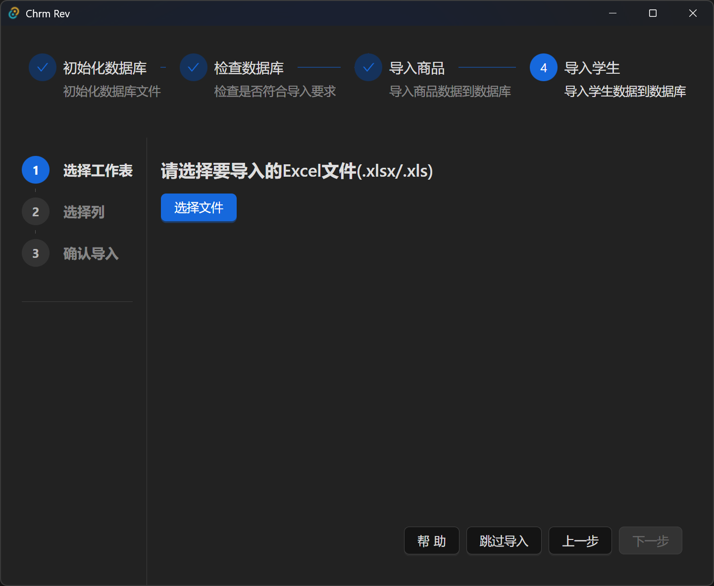
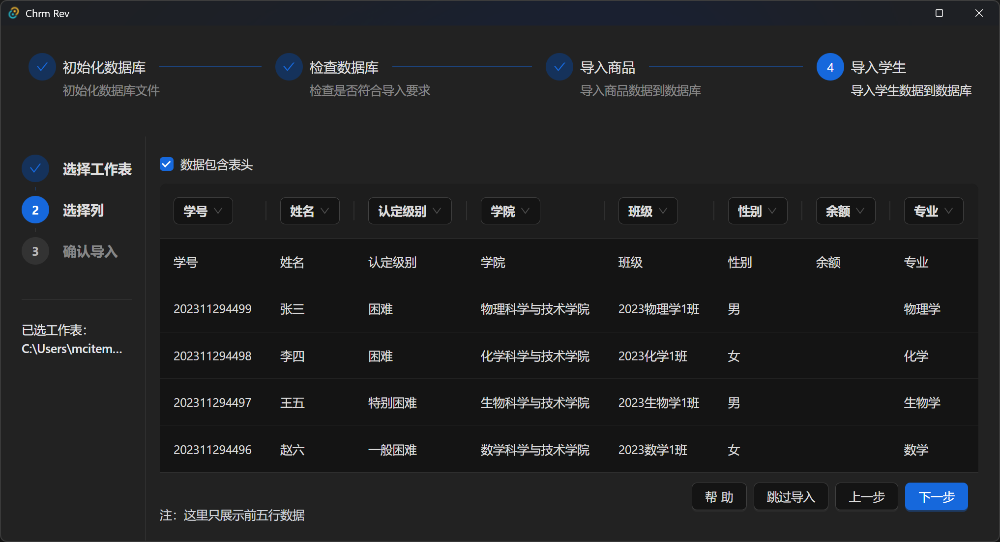
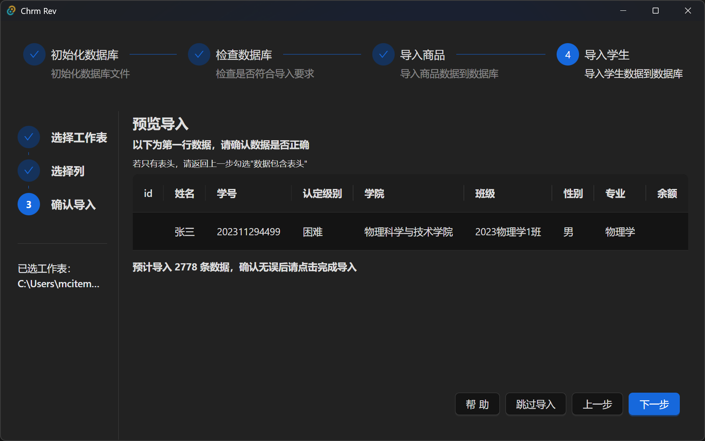
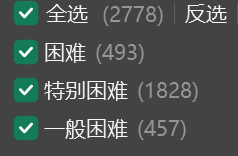

## 数据导入工具使用帮助

## 导入前准备

你需要准备好商品数据和学生数据的execl表，可以放在同一个execl文件中，也可以放在不同的文件中。

::: warning
**注意:学生数据应剔除不困难的数据**
:::

### 初始化数据库

此阶段会检查数据库是否建表，如未建表则会自动建表，一般自动完成无需关注

### 检查数据库

此阶段会检查数据库是否已经有数据，系统只允许在没有数据的情况下进行导入数据

#### 数据库中已有数据时

则会提示用户进行备份并清除数据库。点击备份后会自动将数据目录以.zip压缩文件形式备份到桌面，然后删除现有的数据库并重新完成初始化。

### 导入商品

在导入商品界面中，首先需要选择需要导入的execl数据文件（.xls/.xlsx）。

在这里你可以通过将文件拖动进窗口快捷选择，或者是点击选择按钮选择文件

选择文件后，系统会列出该execl文件中所有可用的表格（sheet）

_excel文件中的可用工作表_

_提示选择工作表_

在选择完工作表，并点击下一步后，系统会尝试加载该execl文件并列出前5行数据。

在选择数据列这一步，你需要为数据配对正确的信息列。这一步数据会尝试将表格第一行数据的值与表头比对，如果相符就会自动匹配。

如果系统自动匹配失败，你需要手动点击表格数据上方的选择器，为其配对正确的表头

导入商品时，除`id`外，所有的列都需配对成功才允许点击下一步进行导入。

如果你的execl数据表格中第一行数据是表头，请勾选数据包含表头。然后在下一步（即这里加载出来的前五行，第一行是表头信息。那就应该勾选。如果加载出来的5行都是具体的数据，就应该取消勾选数据包含表头）

配对列信息并点击下一步后，会进入导入预览界面

在导入预览中，请确认这些数据是否与你要导入的第一行数据相同，并确认总数据量，特别要核对价格是否正确。

在这里的id（数据库主键）可以为空（即当上一步没有指定时），导入时系统会自动分配id。如果你导入数据时配对了id，则会使用导入时提供的id.

::: warning
请注意，商品id不允许有重复（也作为商品编号使用。
:::

点击下一步后，系统会尝试导入数据。并提示成功导入几条数据。

### 导入学生

::: warning
**注意：你不应该导入不困难的学生数据，请提前剔除并只保留经认定的学生数据**
:::
认定级别只支持识别`一般困难`、`困难`、`特别困难`。分别对应三种价格，如果导入的数据等级名称与此不同，会被认为是`不困难`，从而初始化余额变成`0.00`

导入商品后，系统会跳转到导入学生界面。
此界面的操作逻辑与导入商品相同，相同操作方法不再赘述

_导入学生 选择工作表_

_导入学生 选择列_

导入学生时，必需的列只有（姓名、学号、认定级别）

其中学号不允许有重复。如果没有学号，也可以使用身份证替代学号列进行导入（因为身份证与学号相同不会重复。

余额列可以空着不选，余额如果没有数据，会自动依据余额配置初始化额度。如果设置了数据就会设置为你设置的数据。

id列与导入商品时的id行为相同，作为数据库主键，不能重复，不提供会自动按顺序生成

在导入学生的第三步预览中，请检查是否和预期的数据是否相同（id、余额、等其他非必填列显示为空是正常的。

点击下一步后将导入学生数据、并自动返回桌面。

## 导入后工作

在使用导入工具导入后，你应该对数据进行检查。

使用`菜单-管理-数据导出`工具，将数据导出成一个execl文件。文件自动保存到桌面，命名为`chrm-rev_年-月-日_时-分-秒_xxxxxx.xlsx`

此文件会有两个子工作表，一个为`item`,即商品

此表的表头含义

| id     | name     | spec | price | p_easy          | p_normal    | p_hard          | p_score  |
| ------ | -------- | ---- | ----- | --------------- | ----------- | --------------- | -------- |
| 商品id | 商品名称 | 规格 | 原价  | 一般困难（7折价 | 困难（5折价 | 特别困难（3折价 | 积分价格 |

请检查是否和预期的数据相同

另一个为`stu`,含义为学生表

| id     | name     | student_no | difficulty_level | secondary_school | class | sex  | major | balance |
| ------ | -------- | ---------- | ---------------- | ---------------- | ----- | ---- | ----- | ------- |
| 学生id | 学生姓名 | 学号       | 认定级别         | 学院             | 班级  | 性别 | 专业  | 余额    |

请检查是否和预期的数据相同、特别是困难认定级别是否被错误的识别成不困难、初始化的余额是否和预期相同、（一般困难、困难、特别困难）不同级别的人数是否对应正确

如果数据检查有问题，请重新导入！！！

## datagrip

你也可以使用datagrip直接编辑数据库导入数据。

[datagrip](./datagrip.md)
