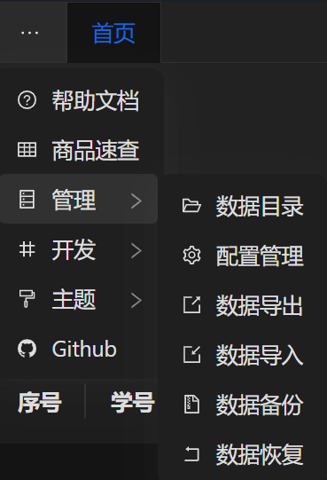

## 菜单

这里介绍了所有左上角菜单的用途



## 帮助文档

点击后进入此文档（无需联网）

## 商品速查

列出所有商品，便于查询商品信息

## 管理

### 数据目录

快捷打开[数据目录](./datadir.md)

### 配置管理

快捷打开[配置管理](./configloader.md)

### 数据导出

将商品、学生数据导出到execl(.xlsx)文件中

> 数据导出后，可通过在execl中便捷的编辑数据，编辑完后可通过数据导入工具重新导入回去

### 数据导入

和数据导出是一对工具，在这里你可以便捷的将execl形式的商品、学生数据导入到数据库中

> 此工具能自动帮你备份并删除原有数据库，以便重新导入新的数据

[数据导入](./dataloader.md)

### 数据备份

自动将数据目录下的所有文件备份成压缩文件（.zip）

### 数据恢复

和数据备份是一对工具，一键还原备份压缩文件（.zip）到数据目录

[备份、恢复备份](./backup.md)

## 开发

仅限用于调试的工具，如果不清楚用途和后果请勿使用

### 调试工具

此工具允许向内嵌的http后端发送请求

### DevTools

打开webview F12 开发者工具

## 主题

调整界面主题，支持深色模式、浅色模式、跟随系统

## Github

访问源代码托管仓库、下载Chrm Rev等

```
https://github.com/mcitem/chrm-rev
```
